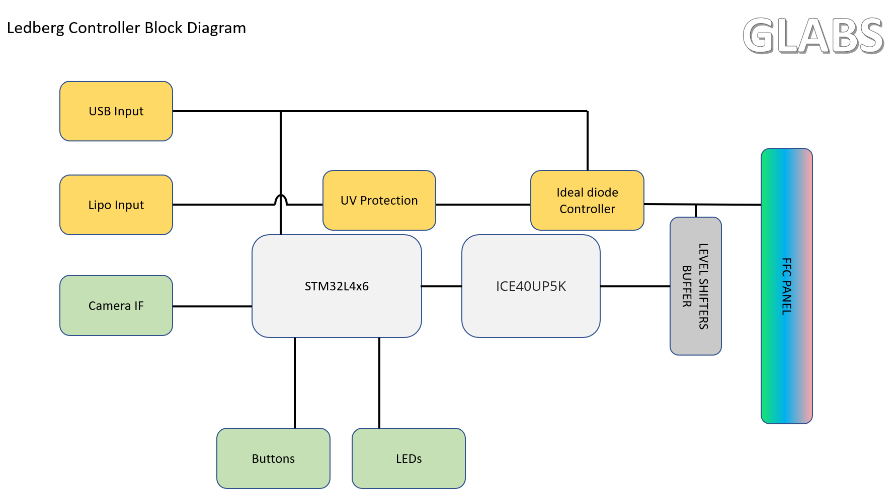
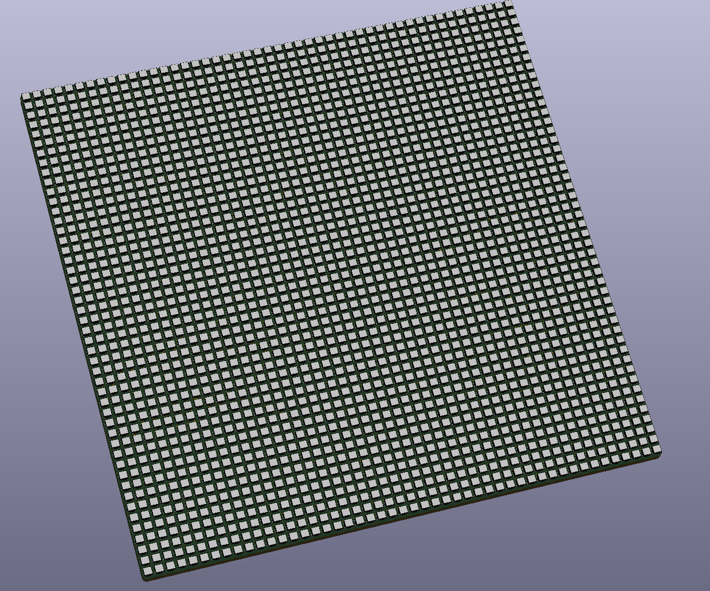
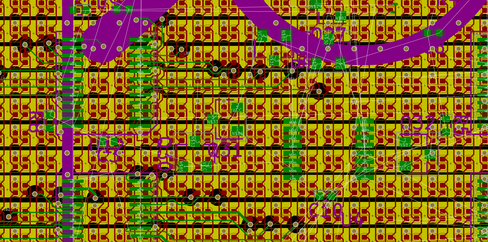
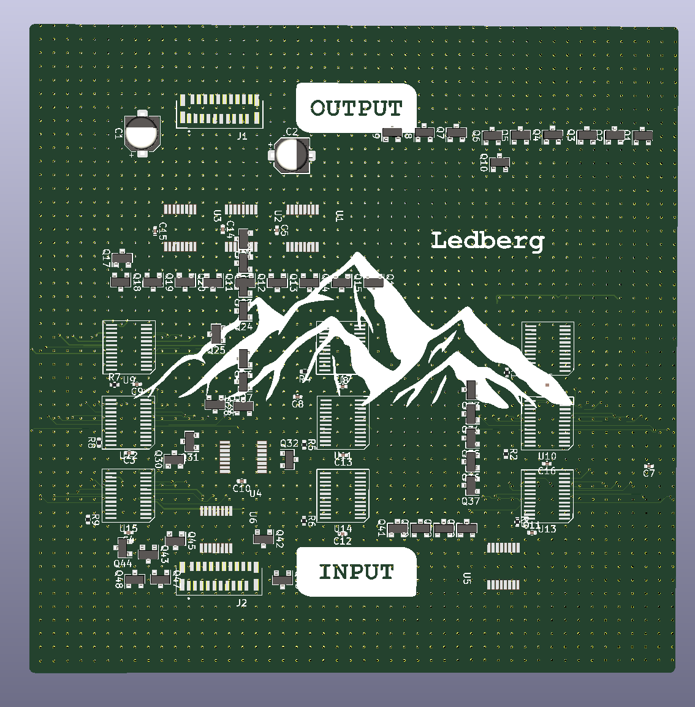

# OldSchoolPeepers
OldSchoolPeepers is a 48x48 squared form-factor led panel which streams a camera output in quantified shades of color, inspired by Greg Davill.

## Panel close-up view
### Front

### Back

